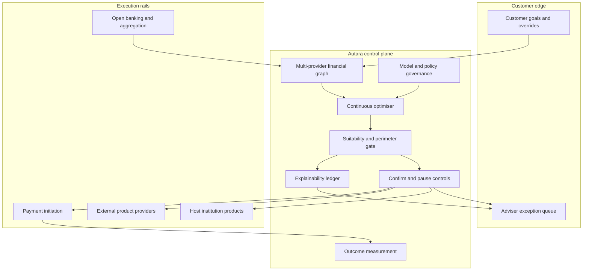

# Autara

**Source:** `ai-in-financial/WEF_New_Physics_of_Financial_Services/`
**Domain:** `ai-fin`
**One-liner:** A self-driving personal-finance agent that continuously optimises a household’s bills, savings, debt, and product switches across providers — under explicit suitability, explainability, and human-override controls.
**Wedge:** Digitally native retail banks and licensed wealth platforms in open-banking markets that already aggregate multi-provider accounts and need an outcome-owned advice layer, not another product catalogue chatbot.
**Positioning:** Customer-loyalty and self-driving-finance infrastructure for the “new physics” of financial services. The WEF report argues AI will automate routine financial lives and make front-office differentiation about outcomes rather than rate races; Autara is the control plane that turns that thesis into governed, multi-provider automation instead of a black-box robo that silently moves money.

## Market research synthesis

### Thesis from source

*The New Physics of Financial Services* (WEF / Deloitte) argues that focusing only on AI use-cases misses a deeper shift: first-movers compound data advantages across front and back office; markets bifurcate toward scale and niche agility; operating models become specialised, lean, and dependent on technology players; and historical bonds holding institutions together weaken as new centres of gravity form. Across deposits and lending, insurance, payments, investment management, capital markets, and market infrastructure, AI enables strategies from “same thing better” (fraud precision, reconciliation automation, claims triage) to “radically different” (prediction-as-a-service, invisible payments infrastructure, outcome-based portfolios).

Nine cross-sector findings structure the thesis. Finding 1: institutions will turn ai-enabled operations into external services, forcing peers to become consumers of those capabilities. Finding 2: as prior differentiators erode, AI is the escape from price race-to-the-bottom via new loyalty mechanics. Finding 3 — the product wedge — states that future customer experiences centre on AI that automates much of customers’ financial lives and improves outcomes: routine decisions (bill payment, savings, cash-flow) run below perception, while complex moments (home purchase, refinancing, retirement) surface advice. The report names three enablers: empowered multi-provider platforms that compare and switch; mass personalised advice and bespoke product features; and continuous optimisation algorithms. Finding 9 warns that ethical grey areas and regulatory uncertainties reduce willingness to adopt transformative AI unless principles and supervisory techniques are re-examined. Shared prosperity is not guaranteed: workforce engagement, collaborative solutions for shared problems, and human-centric deployment are explicit conditions.

Autara therefore does not sell “an LLM for banking.” It sells a governed self-driving agent that is institution- and product-agnostic enough to switch, explainable enough for adverse or material actions, and interruptible enough that loyalty is earned from outcomes rather than lock-in.

### Buyer & economic model

- **Primary buyer:** Chief Digital Officer or Head of Retail / Wealth Experience at a bank or licensed advice platform competing on loyalty after fee and rate compression.
- **Users:** end customers (goal setting and overrides), financial coaches / advisers (exception review), product managers (automation policy), model risk and conduct officers (suitability and explainability), operations (failed payment and switch exceptions).
- **Budget owner / value metric:** retail P&L and customer lifetime value. Value metrics are share of eligible routine decisions automated, verified improvement in customer financial outcomes (fees avoided, interest saved, savings rate), retention/NPS versus price-only competitors, and conduct incident rate on automated actions.
- **Competing status quo:** single-provider budgeting apps, human advisers for mass affluent only, rule-based bill pay, and open-banking aggregators that show balances but do not act under fiduciary-grade controls.

### Domain constraints

- **Regulatory / trust / safety:** suitability and advice boundaries; explainability duties for material automated decisions; fair treatment and disparate impact; complaints and redress; operational resilience if the agent fails mid-switch; outsourcing and third-party concentration when models or data come from vendors.
- **Data sensitivity:** multi-provider account and transaction data; inferred financial stress; consent for actioning versus read-only aggregation; retention of decision rationales without retaining unnecessary sensitive attributes.
- **Change-management realities:** customers fear silent money movement; advisers fear disintermediation; institutions fear disintermediating their own deposit franchise. Autara must default to propose-then-confirm for capital-moving actions until trust thresholds are met, and must not optimise purely for the host bank’s product shelf when a better external fit exists (the source’s platform-agnostic requirement).

## Business requirements

- BR-1: Customers must define goals and hard constraints (emergency buffer, max risk, excluded providers); the agent may not breach hard constraints without explicit override.
- BR-2: Routine actions (bill scheduling, savings sweeps, low-risk switches under a threshold) may auto-execute; material actions (refinance, investment allocation change, provider switch above threshold) require confirm or adviser review.
- BR-3: Every automated or recommended action must produce a plain-language rationale and the top decision factors, suitable for customer explanation and conduct review.
- BR-4: When the agent recommends or executes a switch away from the host institution’s product, the recommendation must still surface if it improves the customer’s stated outcome — loyalty cannot be purchased by hiding better options.
- BR-5: Suitability and advice-perimeter rules must gate actions by customer segment and jurisdiction; out-of-perimeter requests escalate to a licensed human.
- BR-6: Customers must pause, reverse (within a cooling window), or permanently disable automation categories without losing account access.
- BR-7: Outcome reporting must show fees avoided, interest differential, and goal progress versus a no-automation baseline the customer can understand.
- BR-8: Model and policy changes that alter action propensity require versioning, approval, and rollback — conduct cannot depend on an untracked prompt edit.
- BR-9: Complaints about an automated action must freeze related automation, open a redress case, and preserve the decision record.
- BR-10: Fair-lending and disparate-impact monitoring must run on recommendation and approval rates by protected-class proxies where legally required, with documented remediation.
- BR-11: Third-party model and data dependencies must be inventoried with concentration limits and failover behaviour when a provider is unavailable.
- BR-12: Workforce coaches must receive exception queues (failed switches, suitability edge cases) so AI deployment does not strand customers when automation breaks.

## User stories

Canonical user stories live in sibling [USER_STORIES.md](USER_STORIES.md).

## System design

### Overview

Autara connects to multi-provider account and product data (open banking / aggregation), maintains a customer goal and constraint graph, and runs continuous optimisation policies that propose or execute actions. A suitability and advice-perimeter gate sits in front of every action. Material actions enter human or customer confirmation. Every decision writes an explainability record. Outcome measurement compares realised results to a counterfactual baseline. Governance services version policies and models, handle complaints freezes, and monitor fairness and vendor concentration.

### Actors & boundaries

- **Actors:** customer, adviser/coach, host institution product systems, external product providers, Autara optimisation engine, conduct/model-risk officers, vendors (data/models).
- **Trust boundary:** payment and switch execution credentials remain with licensed payment/initiation providers; Autara holds goals, policies, decision records, and orchestration rights — not unlimited custody. Customer PII and transaction detail are purpose-limited to optimisation and advice.
- **Human-in-the-loop points:** material action confirmation; suitability edge cases; complaint redress; model promotion approval; inclusion of new action types.

### Core capabilities

1. **Goal and constraint management** — customer objectives, hard limits, excluded providers.
2. **Multi-provider financial graph** — accounts, products, rates, fees, cash-flow.
3. **Continuous optimisation** — routine automation below perception.
4. **Advice and switch recommendations** — multi-provider comparison for material moments.
5. **Suitability and perimeter gating** — jurisdictional advice rules.
6. **Explainability ledger** — rationales and factor attributions per action.
7. **Confirmation and override** — confirm, pause, reverse, disable.
8. **Outcome measurement** — fees/interest/goal progress vs baseline.
9. **Conduct, fairness, and complaints** — monitoring, freeze, redress.
10. **Model/policy governance and vendor inventory** — versioning, approval, concentration limits.

### Conceptual data

- **Primary entities:** CustomerProfile, Goal, Constraint, FinancialAccount, ProductOffer, OptimisationPolicy, ActionProposal, ExecutedAction, ExplanationRecord, SuitabilityCheck, Confirmation, ComplaintCase, OutcomeReport, ModelVersion, VendorDependency.
- **Critical events:** goal set, proposal generated, suitability passed/failed, action confirmed/executed/reversed, complaint opened, model approved/rolled back, vendor failover.
- **Retention / audit needs:** explanation and suitability records retained for advice and complaints windows; raw transaction feeds retained per open-banking and privacy rules; model versions immutable once used in production decisions.

### Integrations (conceptual)

- **Systems of record:** core banking, wealth platforms, card issuers, billers.
- **Upstream signals:** open-banking aggregators, rate/fee market data, credit offers, customer CRM events.
- **Downstream actions:** payment initiation, product application handoff, adviser tasking, notification, complaint case systems.

### High-level architecture

Read-and-optimise is continuous; money movement is gated. Explainability and conduct are not analytics afterthoughts — they are on the action path.

### Success metrics

- **Leading:** % of eligible routine decisions auto-executed; median time-to-confirm for material actions; explanation open rate; pause/disable rate; suitability fail rate.
- **Lagging:** verified fees/interest saved per active customer; retention and NPS versus price-matched control; complaint rate per 1,000 automated actions; deposit cannibalisation vs external-switch win rate (honest loyalty); model-change incident rate.

## OpenAPI skeleton

Canonical HTTP surface lives in sibling [openapi.yaml](openapi.yaml). Summary:

- **Base path:** `/v1/...`
- **Auth:** `X-API-Key` for bank/partner integration; Bearer JWT for customers, coaches, and conduct operators.
- **Resource groups:** Goals, Accounts, Proposals, Actions, Explanations, Complaints, Governance.
