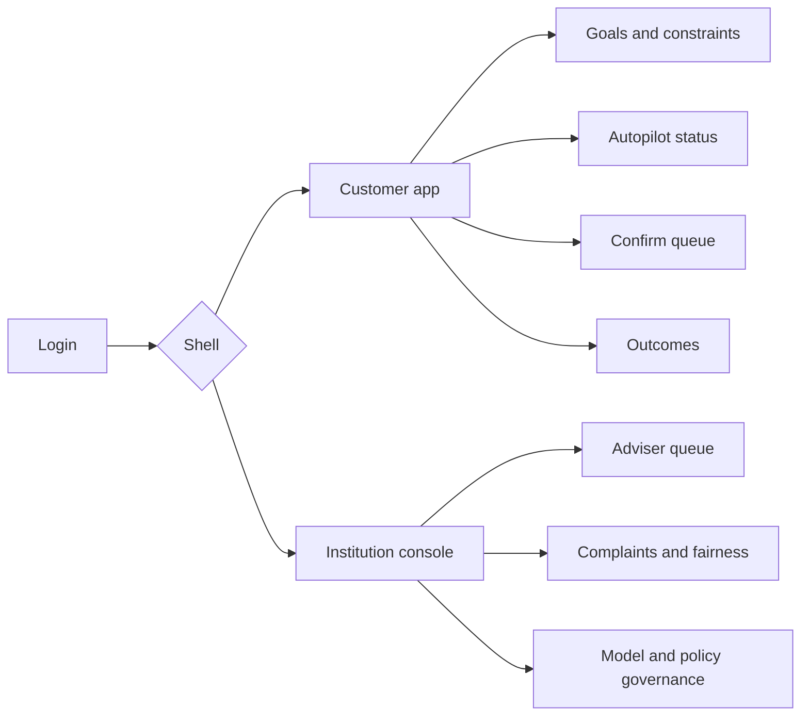
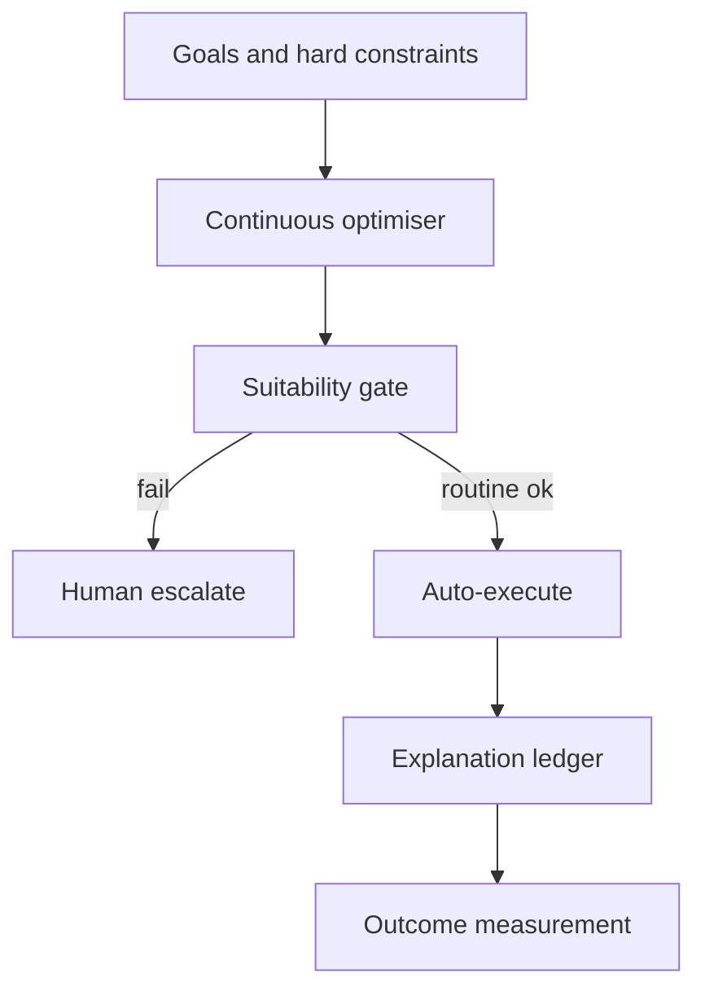

# Autara — Web app

**Product:** [PRODUCT.md](./PRODUCT.md)
**Primary surface:** Dual shell — customer self-driving finance app + institution conduct/ops console
**Secondary surfaces:** Adviser exception queue; model/policy governance console
**Design thesis:** Autara is a glass cockpit for household money — the UI metaphor is an always-on autopilot with visible instruments and a big pause switch, not a chatbot that “handles your finances.” Visual language is deep ocean teal and horizon-white instruments: routine auto-actions feel quiet and below-perception; material switches feel like illuminated confirmations; host-bank-losing recommendations still surface honestly. The Autara wordmark sits as a quiet instrument mark on every goal and explanation screen so customers know whose agent is flying—and that they can disconnect anytime.

## UX research synthesis

### Category peers (best-in-class)

- **Monzo / Revolut Insights + Bills:** Clear cash-flow and bill scheduling with human-readable money language. Steal: below-perception routine automation UX; reject gamified spending as the loyalty story.
- **Wealthfront / Betterment (robo advice):** Goal graphs, tax/fee transparency, confirm on material allocation changes. Steal: propose-then-confirm for capital moves; reject black-box portfolio moves without plain-language factors.
- **Cleo / Digit (automation agents):** Sweep and bill automation with pause controls. Steal: instant pause/disable categories (BR-6); reject opaque “we moved your money” without rationale (BR-3).
- **Bank coach consoles (e.g. advice platforms’ exception queues):** Human review for edge cases. Steal: same rationale customer and coach see (adviser story); reject dual storytelling.

### Patterns to adopt / reject

- **Adopt:** Goals + hard constraints first; auto vs confirm by threshold; plain-language rationale + top factors; honest external switches (BR-4); suitability perimeter gate; pause/reverse/disable; outcome vs no-automation baseline; complaint freeze; fairness monitoring; vendor failover inventory.
- **Reject:** Chat-first as the only surface; silent money movement for material actions; host-shelf-only recommendations; purple “AI money coach” orbs; engagement vanity over fees-avoided outcomes.

### Trust, density, and workflow constraints from PRODUCT.md

Customers fear silent moves — default propose-then-confirm for capital-moving until trust thresholds (change-management). Advice perimeter and suitability by jurisdiction (BR-5). Loyalty cannot hide better external options (BR-4). Payment credentials stay with licensed rails; Autara orchestrates (trust boundary). Complaints freeze automation and preserve decision packets (BR-9). Coaches need exception queues so failures don’t strand customers (BR-12).

## Information architecture

### Nav model

### Roles → default home

| Role | Default home | Why |
|------|--------------|-----|
| Retail customer | Autopilot status + goals | Routine below perception; control visible |
| Financial coach / adviser | Exception / confirm queue | Material human judgment (BR-2, BR-12) |
| Conduct / model-risk | Governance + complaints | Policy version + freeze (BR-8, BR-9) |
| Product / experience owner | Outcomes telemetry | Fees avoided / retention (BR-7) |
| Platform admin | Vendor inventory | Failover / kill-switch (BR-11) |

### Cross-links to OpenAPI resources

| Nav area | OpenAPI tags / resources |
|----------|---------------------------|
| Goals / hard constraints | Goals |
| Multi-provider graph | Accounts |
| Optimisation proposals | Proposals |
| Executed / reversed / paused | Actions |
| Rationales / factors | Explanations |
| Conduct freezes | Complaints |
| Models / policies / vendors | Governance |

## Screen inventory

### Customer autopilot home

- **Purpose:** One composition: what Autara is doing, what’s waiting, pause control, outcome pulse.
- **Entry:** Customer default.
- **Layout regions:** Brand mark; autopilot on/paused; next scheduled routine actions; material confirm count; fees avoided this month vs baseline; big pause.
- **Primary actions:** Pause all; open confirm queue; edit goals; disable a category.
- **Empty / loading / error:** Empty = connect accounts + set goals; error = retry with request id.
- **BR / story ties:** BR-6, BR-7; customer stories.
- **Mobile notes:** Primary customer surface; pause always one tap.

### Goals and hard constraints

- **Purpose:** Objectives and non-breachable limits (buffer, max risk, excluded providers).
- **Entry:** Onboarding; settings.
- **Layout regions:** Goal cards; constraint list; excluded providers; breach attempt log (should be empty).
- **Primary actions:** Add/edit goal; set hard constraint; require override acknowledgment.
- **Empty / loading / error:** Agent blocked until minimum goals exist (BR-1).
- **BR / story ties:** BR-1.

### Multi-provider financial graph

- **Purpose:** Accounts, products, rates, fees, cash-flow across providers — platform-agnostic view.
- **Entry:** Accounts nav.
- **Layout regions:** Account list; offer compare; host vs external markers (honest).
- **Primary actions:** Link account; refresh; open switch proposal.
- **Empty / loading / error:** Aggregation fail = partial graph with clear gaps.
- **BR / story ties:** BR-4; Accounts resource.

### Confirm queue (material actions)

- **Purpose:** Refinance, allocation change, large switches — confirm or adviser review.
- **Entry:** Home badge; push notification.
- **Layout regions:** Proposal card; plain-language rationale; top factors; suitability status; confirm/decline; cooling-window reverse after execute.
- **Primary actions:** Confirm; decline; ask adviser; reverse within window.
- **Empty / loading / error:** Empty = “no material actions waiting”; suitability fail escalates (BR-5).
- **BR / story ties:** BR-2, BR-3, BR-5.

### Explanation ledger (customer)

- **Purpose:** Every automated or recommended action with rationale suitable for conduct review.
- **Entry:** From action history; complaint path.
- **Layout regions:** Chronological explanations; factor attributions; policy version stamp.
- **Primary actions:** Open detail; share with coach; file complaint.
- **Empty / loading / error:** Missing rationale = coral incident (BR-3).
- **BR / story ties:** BR-3, BR-8.

### Outcomes report

- **Purpose:** Fees avoided, interest differential, goal progress vs no-automation baseline.
- **Entry:** Home; product owner telemetry (aggregated).
- **Layout regions:** Baseline compare chart; category breakdown; plain-language summary.
- **Primary actions:** Export; adjust goals from insight.
- **Empty / loading / error:** Insufficient history = early empty state (BR-7).
- **BR / story ties:** BR-7; product owner stories.

### Adviser exception queue

- **Purpose:** Material recommendations and suitability edge cases with same rationale customer sees.
- **Entry:** Coach login.
- **Layout regions:** Queue by SLA; dual-pane proposal + explanation; customer context (need-to-know).
- **Primary actions:** Approve; reject; request more info; escalate licensed advice.
- **Empty / loading / error:** Empty = healthy message (BR-12).
- **BR / story ties:** BR-2, BR-5, BR-12.

### Complaints and freeze

- **Purpose:** Freeze related automation, open redress, preserve decision packet.
- **Entry:** Customer complaint; conduct desk.
- **Layout regions:** Case; frozen action categories; preserved packet; redress timeline.
- **Primary actions:** Freeze; resolve; reinstate automation with approval.
- **Empty / loading / error:** Freeze is immediate and visible (BR-9).
- **BR / story ties:** BR-9.

### Fairness monitoring

- **Purpose:** Recommendation/approval rates by required proxies with remediation docs.
- **Entry:** Conduct console.
- **Layout regions:** Monitoring charts; threshold breaches; remediation tasks.
- **Primary actions:** Open remediation; block model promotion if required.
- **Empty / loading / error:** Jurisdiction-off = not shown (BR-10).
- **BR / story ties:** BR-10.

### Model and policy governance

- **Purpose:** Version, approve, rollback policies/models that change action propensity.
- **Entry:** Model-risk default.
- **Layout regions:** Version list; diff of propensity; approval workflow; rollback.
- **Primary actions:** Submit; approve; rollback; block untracked edits.
- **Empty / loading / error:** Unapproved version cannot drive production (BR-8).
- **BR / story ties:** BR-8.

### Vendor inventory and failover

- **Purpose:** Third-party model/data deps with concentration limits and kill-switches.
- **Entry:** Platform admin.
- **Layout regions:** Vendor table; concentration; failover behaviour; half-executed switch protection.
- **Primary actions:** Kill-switch; test failover; escalate concentration.
- **Empty / loading / error:** Outage mode banner on customer app (BR-11).
- **BR / story ties:** BR-11.

## Key flows

1. **Routine autopilot** — goals/constraints → optimiser → suitability → auto-execute under threshold → explain ledger → outcomes; failure: constraint breach blocked.

2. **Material switch** — proposal → explanation → customer/adviser confirm → execute → cooling reverse window (BR-2, BR-3).

3. **Honest external recommendation** — better external fit → surface anyway → host product not hidden (BR-4).

4. **Complaint freeze** — complain → freeze categories → preserve packet → redress (BR-9).

5. **Model promotion** — new version → monitoring thresholds → approve → or rollback (BR-8).

## Design system

### Tokens (CSS variables)

- `--color-ink: #0A1620` — text
- `--color-horizon: #F2F7FA` — instrument panels
- `--color-ocean: #0B3A45` — shell / brand teal
- `--color-signal: #3DB8A0` — autopilot active
- `--color-confirm: #E8B84A` — material confirm needed
- `--color-alert: #D94F3D` — freeze / suitability fail
- `--color-steel: #6A7D89` — secondary labels
- `--font-display: "Sora", sans-serif` — instrument titles (modern cockpit, not Inter)
- `--font-body: "IBM Plex Sans", sans-serif`
- `--font-mono: "IBM Plex Mono", monospace` — action and policy version ids
- `--space-1`…`--space-8`: 4px scale
- `--radius-sm: 6px`; `--radius-md: 12px` — soft instruments, not pill spam
- `--motion-pause: 150ms ease-out` — pause engage
- `--motion-confirm: 220ms ease-in-out` — material confirm glow
- `--motion-auto: 180ms ease-out` — routine action settle
- Atmosphere: ocean teal depth with horizon-white instrument cards; subtle horizon gradient; no purple coach avatar; no chatbot bubble as primary chrome.

### Typography & brand

- Sora for autopilot status numerals; Plex for body; mono for ids.
- Autara mark on customer and ops shells; marketing/login: brand hero (“Self-driving finance you can pause”); one CTA — no rate-race banner.

### Do / don’t

- **Do:** Big pause; explain every action; confirm material moves; show external wins; freeze on complaint.
- **Don’t:** Purple AI glow; silent material switches; host-only shelf bias; chat as sole UX; emoji money; vanity streak metrics over outcomes.

### Accessibility & domain trust cues

- Pause control high contrast and named; live regions for confirm and freeze; explanations not colour-only.
- Focus order: goals → autopilot → confirm → outcomes.
- Reduced motion respects disable of confirm glow.

## Component patterns

- **AutopilotStatusBar** — on / paused / category disables.
- **HardConstraintChip** — non-breachable limits.
- **MaterialConfirmCard** — rationale + factors + confirm.
- **ExplanationFactorList** — top decision factors plain language.
- **OutcomeBaselineCompare** — vs no-automation.
- **ComplaintFreezeBanner** — automation halted + packet link.
- **SuitabilityGateBadge** — pass / fail / escalate.
- **PolicyVersionStamp** — immutable version on actions.
- **VendorKillSwitch** — failover control.
- **CoachExceptionRow** — shared rationale dual-pane.

## Out of scope for v1 web

- Full trading desk; tax-filing software; replacing core banking; native headset AR; unlicensed advice beyond perimeter; marketing CMS; custody of customer funds inside Autara.
